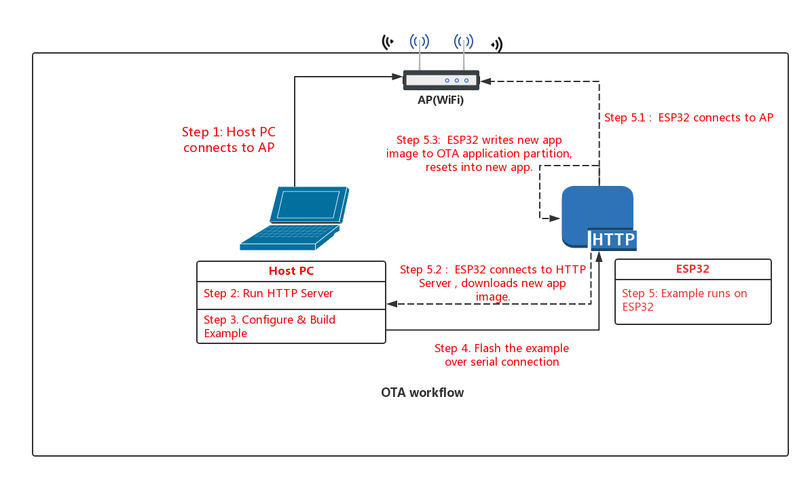

# Simple OTA Demo

This example demonstrates a working OTA (over the air) firmware update workflow via HTTPS. It is based on the examples in the esp-idf that first demonstrate an OTA update via HTTP, and second demonstrate connecting via HTTPS using the MBEDTLS/LWIP libraries.

---

# Aim

An app running on ESP32 can upgrade itself by downloading a new app "image" binary file, and storing it in flash.

In this example, the ESP32 has 3 images in flash: factory, OTA_0, OTA_1. Each of these is a self-contained partition. The number of OTA image partition is determined by the partition table layout.

Flashing the example over serial with "make flash" updates the factory app image. On first boot, the bootloader loads this factory app image which then performs an OTA update (triggered in the example code). The update downloads a new image from an http server and saves it into the OTA_0 partition. At this point the example code updates the ota_data partition to indicate the new app partition, and resets. The bootloader reads ota_data, determines the new OTA image has been selected, and runs it.


# Workflow

The OTA_workflow.png diagram demonstrates the overall workflow:



## Step 1: Connect to AP

Connect your host PC to the same AP that you will use for the ESP32.

## Step 2: Build / Upload the OTA update

For our upgrade example OTA file, we're going to use the `get-started/hello_world` example.

Open a new terminal, then run these commands to build the example:

```
cp $IDF_PATH/examples/get-started/hello_world .
cd hello_world
make menuconfig (if any custom options need to be set like your python location)
make
```

Once you have successfully built the example, the output binary will be present at `build/hello_world.bin`. This file will then need to be uploaded to a remote server that the harness will connect to and download it from. In our example we will use Amazon S3. You can sign up for a free amazon trial account which includes S3 access if you do not already have storage available in another place.

Login to your Amazon AWS console, and select the S3 service. Create a new bucket for this example, then upload the `hello_world.bin` file to the bucket. Make sure to add public read access so the harness can actually download the file. In a production setting you would actually want to convert the bucket to cloudfront and serve the file via a signed url that would require a token to be generated for download access and would expire the link after five minutes to securely serve the firmware.

Once the firmware is uploaded to S3, you should be able to select its object in the bucket and view the download link. You will need this link in the next steps.

NB: You've probably noticed there is nothing special about the "hello world" example when used for OTA updates. This is because any .bin app file which is built by esp-idf can be used as an app image for OTA. The only difference is whether it is written to a factory partition or an OTA partition.

## Step 3: Create the server certificates file

Now we need to create the server certificate file. Typically when you connect to a server via HTTPS in a browser the certificate is already included with the browser for the known certificate authorities (CA's). However, because are on an embedded device we need to obtain and store the specific certificate that we are using on the device itself manually.

Open a terminal (or the mingw shell that you use with the esp-idf if you are on Windows), and type the following:

```
openssl s_client -showcerts -connect <your-server-dns>:443 < /dev/null
```

I used `s3.amazonaws.com` as my server dns in the example. The results of this will show a few certificates along with some certificate information. You need to copy everything starting with the first `-----BEGIN CERTIFICATE-----` until (and including) the last `-----END CERTIFICATE-----` line. Between each cerficate there may be some informational lines that should be removed.

The certificates should be placed in a file `main/server_root_cert.pem` which is referenced by the example code and build process.

## Step 4: Build OTA Example

Change back to the OTA example directory, and type `make menuconfig` to configure the OTA example. Under the "Example Configuration" submenu, fill in the following details:

* WiFi SSID & Password
* DNS address of the remote server hosting your OTA update file
* HTTP Port number
* Path on the server to your OTA update file (i.e. `/aws-bucket-name/hello-world.bin`)

Save your changes, and type `make` to build the example.

## Step 4: Flash OTA Example

When flashing, use the `erase_flash` target first to erase the entire flash (this deletes any leftover data in the ota_data partition). Then flash the factory image over serial:

```
make erase_flash flash
```

(The `make erase_flash flash` means "erase everything, then flash". `make flash` only erases the parts of flash which are being rewritten.)

## Step 5: Run the OTA Example

When the example starts up, it will print "ota: Starting OTA example..." then:

1. Connect to the AP with configured SSID and password.
2. Connect to the HTTP server and download the new image.
3. Write the image to flash, and configure the next boot from this image.
4. Reboot
